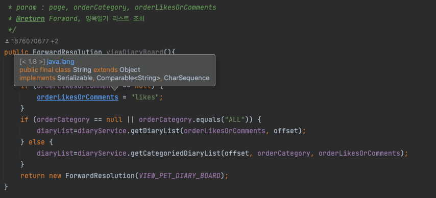
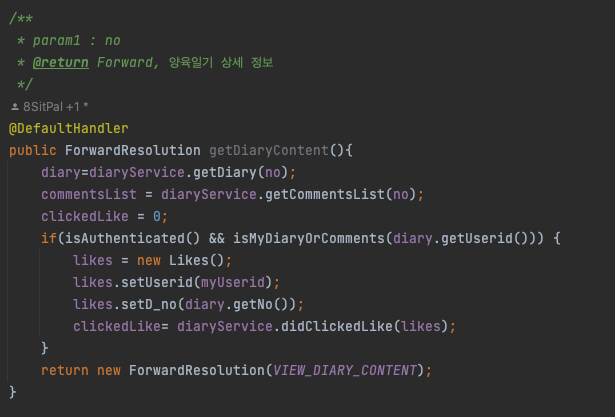

## ver 1.1.0 수정 내역

### 1. 모든 메서드에 필수 파라미터가 무엇인지 명시하였습니다.

### 2. 모든 insert, update, delete uri접근시 로그인 확인, 내 게시글 또는 내가 작성한 덧글임을 확인할 수 있도록 validation을 추가하였습니다.
### 3. 현제 insert, update, delete 이후 ForwardResolution으로 인해 url가 이전 행동에 대한 정보를 계속 가지고 있었는데, DiaryActionBean에 @DefaultHandler를 추가해줌으로써 Redirect를 할 수 있게 되었습니다.

### 4. clear() 메소드를 이용하여 어떤 행위가 이루어진 뒤에 필요없는 녀석들은 초기화 또는 null을 담는 로직을 추가하였으며, 모든 연산에 적용될 수 있습니다.
### 5. 검색이 가능해졌습니다. 검색 기능시 keyword의 유지 유무 때문에 reset 변수가 추가되었으며 reset = 1일 경우 마찬가지로 clear()메소드가 실행됩니다.