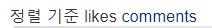

## ver 1.0.0 수정 내역
<details>
<summary>수정 내역 보기</summary>
<div markdown="1">
1. 페이징 처리
    + DiaryActionBean에 변수 및 메소드가 추가되었습니다.
      ```
        class DiaryActionBean {
          //paging 처리
          private int totalCount;
          private int beginPage;
          private int endPage;
          private boolean next;
          private boolean prev;    
          ...

          public void paging() {
            //Diary 총 갯수를 가져와서 몇개의 페이지를 표시할지 나타낸다
            totalCount = diaryService.getDiaryCount();
            endPage = ((int)Math.ceil(page / (double)10)) * 10;

            beginPage = endPage - (10 - 1);

            int totalPage = (int)Math.ceil(totalCount / (double)6);

            if (totalPage < endPage) {
              endPage = totalPage;
            } else {
              next = true;  
            }
            prev = beginPage!=1;
        }
        ```
    + DiaryActionBean에서 viewDiary() 메소드가 실행될 때 자동으로 paging() 메소드가 실행됩니다.
      ```
      public ForwardResolution viewDiaryBoard(){
        paging();
        diaryList=diaryService.getDiaryList(page);
        return new ForwardResolution(VIEW_PET_DIARY_BOARD);
      }
      ```
    + DiaryService와 DiaryMapper에 getDiaryCount()메소드가 추가되었습니다. 해당 메소드는 작성된 Diary의 갯수를 반환합니다.


2. 파일 업로드
   + pom.xml에 Dependency가 추가되었습니다.
      ```
     <!-- https://mvnrepository.com/artifact/commons-fileupload/commons-fileupload -->
      <dependency>
         <groupId>commons-fileupload</groupId>
         <artifactId>commons-fileupload</artifactId>
         <version>1.4</version>
      </dependency>
     ```
   + application.properties 에 static 경로(이미지 저장 경로)설정 부분이 추가됩니다.
      ```
      spring.mvc.static-path-pattern=/static/**
      spring.resources.static-locations=classpath:/static/
      spring.resources.add-mappings=true
     ```
   + DiaryActionBean 에 업로드된 이미지를 받을 FileBean 변수가 추가됩니다.
   + insertDiary() 메소드에서 로그인을 확인합니다
   + DiaryActionBean에 isAuthenticated() 로그인을 확인하는 메소드가 추가되었습니다.
   + src/main/webapp/static 폴더에 업로드 된 이미지가 저장됩니다. 현재는 주석처리 되어있으며 테스트시에는 해당 폴더내의 default.png파일을 불러오도록 설정되어있습니다.


3.Diary 도메인 클래스의 수정
+ setUserid(), setCategoryid(), setTitle(), setContent() 메소드는 insertDiary()할 때 꼭 필요한 항목들이므로 @Validate를 이용하여 꼭 세팅될 수 있도록 하였습니다.
+ 추후 해당 내용과 관련하여 update할 때의 메소드 역시 on = {} 내부에 추가하도록 합니다.

4.한글 깨짐 해결
+ web.xml에 인코딩 필터를 추가하였습니다.


..그 외 자잘한 로직들이 조금씩 수정되었습니다.
현재 가능한 기능은 insert와 getDiaryList입니다! 상세 페이지를 만들고 나머지 기능 붙이는거 진행하겠습니다.
</div>
</details>

## ver 1.0.1 수정 내역 - cji_1.0.1
<details>
<summary>수정 내역 보기</summary>
<div markdown="1">
+ 게시판 정렬 기준에 따른 메소드들을 추가했습니다.
+ getDiaryListOrderByComments: 전체 카테고리 게시글 댓글순 정렬
+ getDiaryListOrderByLikes: 전체 카테고리 게시글 좋아요순 정렬
+ getCategoriedDiaryList: 선택된 카테고리 게시글
+ getCategoriedDiaryListOrderByComments: 선택된 카테고리 게시글 댓글순 정렬
+ getCategoriedDiaryListOrderByLikes: 선택된 카테고리 게시글 좋아요순 정렬
+ boardCategoryid 라는 액션빈 변수를 하나 더 만들었습니다. 
+ paging 메소드 실행될 때 boardCategoryid가 null이면 getDiaryCount 메소드를, 
그렇지 않으면 getCategoriedDiaryCount를 사용하도록 하였습니다.
</div>
</details>

## ver 1.0.2 수정 내역 - ksh_1.0.2

<details>
<summary>수정 내역 보기</summary>
<div markdown="1">
### 1. 다이어리 상세 조회 가능
### 2. 다이어리 수정 가능(내 게시글일 경우 수정 혹은 삭제 가능)
### 3. 좋아요 눌렀을 경우와 누르지 않았을 경우 구분
### 4. 덧글 불러오기 가능
</div>
</details>

## ver 1.0.3 수정 내역 - ksh_1.0.3
1. 정렬이 가능해졌습니다!!
2.  원래 IncludeTop.jsp를 그대로 diary에 가져왔습니다. 하지만 해당 글자 클릭시 상품 페이지로 이동하는것이 아닌 다이어리가 해당 카테고리에 맞게 정렬되도록 합니다.
3.  카테고리별 정렬과 별개로 기본적으로 "좋아요 높은 순"이 선택되도록 합니다. 다른 정렬기준으로 "덧글 많은 순"이 존재합니다.
4. 원래 1.0.2에서 DiaryActionBean의 로직이 정렬마다 전부 메소드가 짜여져 있던 것을 단순화 하였습니다.
   1. orderCategory = 정렬할 카테고리 { null, ALL, FISH, DOGS, REPTILES, CAT, BIRDS } 를 원소로 가질 수 있습니다.
   2. orderLikesOrComments = 정렬 기준 { likes, comments } 를 원소로 가질 수 있습니다.
   3. orderCategory == null or ALL 그리고 orderLikesOrComments == null 일 경우 전체를 좋아요 높은 순으로 정렬합니다.

